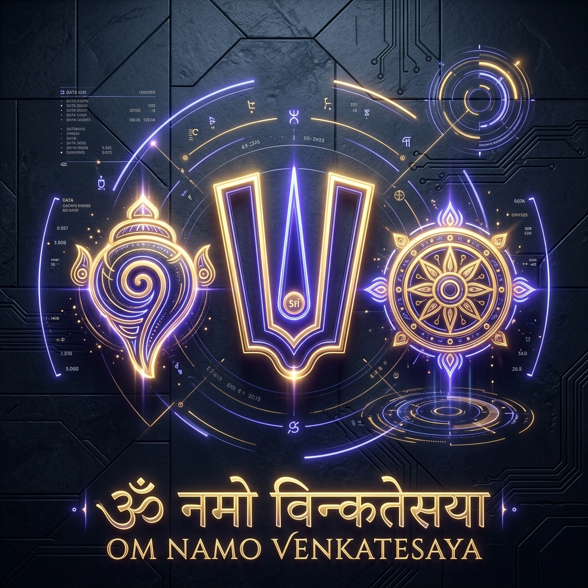
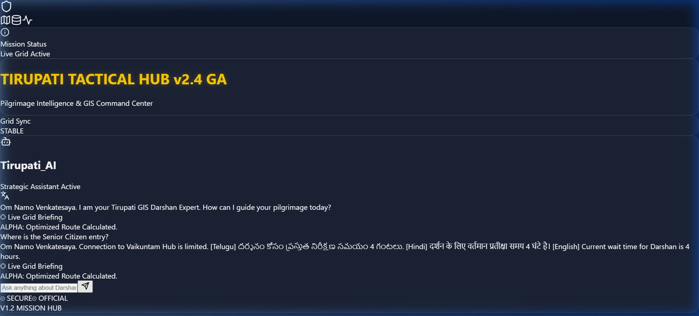

# 🕉️ Darshanam AI: Universal Sacred Grid Management

---

**Darshanam AI** is a mission-critical pilgrimage intelligence platform designed for the total orchestration of India's most significant sacred hubs. Built with a "Divine Tech" aesthetic, it synthesizes real-time telemetry, geographic intelligence, and AI-driven predictive insights.

## 📸 Mission Interface

## 🚀 One-Click Deployment

Click the **"Deploy with Vercel"** button above to launch your own instance of the Darshanam AI Grid.

> [!IMPORTANT]
> **AI Chatbot Setup**: During deployment, Vercel will ask for environment variables. You **MUST** add `VITE_GROQ_API_KEY` (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) to enable the AI Divine Assistant.

## 🛠️ Integrated Sacred Hubs

The platform provides a unified command center for six major sectors:
- **Tirumala (Tirupati Hub)**: Lead sector for crowd telemetry.
- **Vijayawada (Durga Hub)**: River-side pilgrimage orchestration.
- **Srisailam (Mallikarjuna Hub)**: Vertical mountain logistics.
- **Simhachalam (Narasimha Hub)**: Coastal shrine security.
- **Annavaram (Satyanarayana Hub)**: High-volume ritual coordination.
- **Sabarimala (Ayyappa Hub)**: Season-specific forest navigation.

## 💎 Premium Features

- **Strategic Dashboard**: Real-time ticker for waiting times across all 6 hubs.
- **Sacred GIS Map**: Interactive geospatial intelligence with live marker telemetry.
- **AI Divine Assistant**: Multilingual, voice-capable chatbot for ritual guidance and trip planning.
- **Categorical Intelligence**: Real-time breakdown of 'Free' vs. 'Special Entry' waiting periods.
- **Mission Heartbeat**: High-fidelity, animated UI with gold-accented "Divine Tech" aesthetics.

## 💻 Technical Stack

- **Frontend**: Vite + React + Tailwind CSS
- **Intelligence**: Groq AI (Llama-3 models)
- **Mapping**: Leaflet GIS Engine
- **State**: Real-time Hub Heartbeat (liveDataService)

## 🛠️ Local Development

1. Clone the repository: `git clone https://github.com/chegondi2024/darshan.git`
2. Install dependencies: `npm install`
3. Create a `.env` file and add: `VITE_GROQ_API_KEY=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`
4. Launch the hub: `npm run dev`

---

**OM NAMO VENKATESAYA.**
**THE SACRED GRID IS SECURE.**
